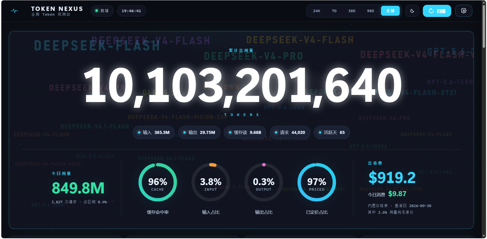
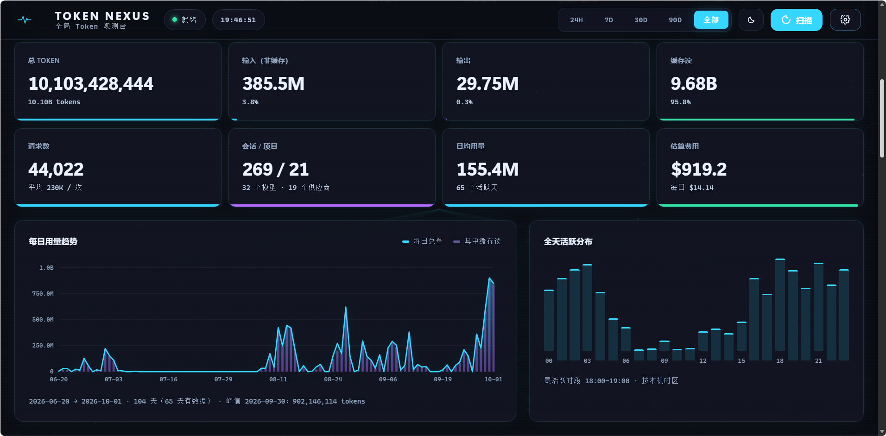

# TOKEN NEXUS · 全局 Token 观测台

把你所有 AI 编程工具和云平台的 token 用量，汇到一个本地面板里。
自动扫描本机日志，读出**逐条请求**的真实明细（不是估算），按模型 / 项目 / 日期聚合成总量和费用。
零依赖、零上传、零构建。





## 快速开始

需要 **Node.js 22.15 或更高**。

```bash
git clone https://github.com/Nicke000/token-nexus.git
cd token-nexus
node server.mjs          # Windows 也可以直接双击 start.bat
```

浏览器会自动打开 <http://127.0.0.1:8787>。首次启动要扫描一遍全部日志（约 30 秒），
之后走增量缓存，基本上 1 秒内打开。想先看结果不开界面：`node server.mjs --scan-only`。

## 像应用一样从桌面打开（可选）

双击一次 `install-shortcut.bat`，桌面上就会出现带图标的 **TOKEN NEXUS** 快捷方式。
以后双击它就行：控制台最小化到任务栏（关掉它即停止服务），面板以一个**没有地址栏的独立窗口**打开。

用的是系统里已有的 Chrome / Edge 的「应用窗口」模式（`node server.mjs --app`），
不额外打包任何东西 —— 整个项目依然是零依赖。

## 数据源

全部自动发现，没有写死任何人的路径。设置 › 数据源 里能看到每一条的探测结果，也可自己加目录。

| 来源 | 粒度 |
| --- | --- |
| DeepSeek Harness · Reasonix · Codex CLI · Claude Code · Cursor · OpenCode · Cline / Roo / Kilo | 逐条请求 |
| 其他 50 多个常见 AI 工具目录（Continue、Aider、Gemini CLI、Qwen Code、Trae、Zed、Amp、Goose……） | 自动嗅探 20+ 种用量字段写法 |
| OpenAI · Anthropic · OpenRouter · DeepSeek 云接口 | 可选，**不填密钥一个请求都不发** |

## 口径

```
总 token = input + cacheRead + cacheWrite + output
```

各家的「input」含义并不一样，直接相加会差一个数量级：OpenAI 系与 Gemini 的 `input` **含**缓存读（需扣除），
DSH 与 Anthropic 的**不含**。这些差异已按实测归一。
查不到价格的模型明确显示「未定价」并标注占总量比例，**不按 0 元静默带过**；
没有单独缓存读单价时退回输入单价计算，而不是按 0 算。

## 隐私

全部解析在**本机**完成，默认只监听 `127.0.0.1`，不发送任何日志内容。
密钥只存 `~/.token-nexus/config.json`（不在仓库里），接口只回显「是否已设置」和末 4 位。

## 开发

```bash
npm test        # 87 项单元测试：zstd 多帧 / 假边界解码、UTF-8 分片边界、用量口径、价格匹配、费用公式
npm run check   # 66 项端到端自检：起真实服务、打全部接口、校验聚合数值自洽
npm run browser # 90 项无头浏览器验收：真开 Chrome，抓控制台报错 + 量真实渲染尺寸 + 出截图
npm run verify  # 全部跑一遍
npm run pricing # 改完 tools/pricing/price-table.json 后重新生成
```

改价格不需要重扫日志（缓存存的是 token 数，费用是读取时才算的）；
改解析逻辑也不需要手动升缓存版本号（缓存版本是扫描器源码的 SHA-256，源码一变自动重扫）。

## License

MIT
